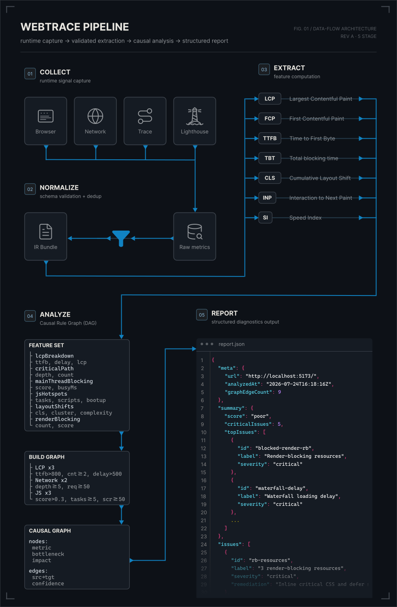

# PerfGraph

[![npm][badge-version]][npm] [![license][badge-license]][license]
[![npm downloads][badge-downloads]][npm] [![github stars][badge-stars]][repo]

> Real browser metrics → causal degradation graph → actionable report. Built for AI agents, useful for humans.

PerfGraph launches a headless Chromium browser, captures performance data via Chrome DevTools Protocol, runs it through a 5-stage analysis pipeline, and spits out a structured JSON report with issues sorted by severity, causal chains, and prioritized fixes.

```bash
npx perfgraph run --url https://example.com --pretty
```

## Why

Lighthouse gives you a score. PerfGraph tells you _why_ it's bad and what to fix first.

Instead of digging through a 10k-line trace.json or a wall of Lighthouse audits, you get a focused report with root causes linked to impact. The output is designed to be read by AI agents (or you) without a decoder ring.

## Pipeline



```
collect → normalize → extract → analyze → report
```

| Step          | What it does                                                                                                                                                                              |
| ------------- | ----------------------------------------------------------------------------------------------------------------------------------------------------------------------------------------- |
| **Collect**   | Launches headless Chromium, captures network, trace, performance API, JS coverage, console logs, DOM snapshot, and Lighthouse audit                                                       |
| **Normalize** | Validates raw data through Zod schemas into a unified Intermediate Representation (IRBundle). All timestamps normalized, data cleaned                                                     |
| **Extract**   | Computes 7 diagnostic feature sets from the IR: LCP breakdown, critical network chain, main-thread blocking time, JS hotspots, layout shifts, third-party overhead, render-blocking score |
| **Analyze**   | Runs 30+ causal rules against the features, builds a directed graph where edges represent known causal relationships with confidence levels (strong/medium/weak)                          |
| **Report**    | Produces a self-contained JSON report with issues sorted by severity, causal chains from root cause to user impact, and prioritized recommendations with expected impact estimates        |

## Install

```bash
npm install -g perfgraph
```

Or skip the install:

```bash
npx perfgraph --help
```

**Requirements:** Node.js ≥ 22, Chromium (Playwright installs it automatically on first run).

## Quick start

Full pipeline, one command:

```bash
perfgraph run --url https://example.com --pretty
```

Step by step:

```bash
# 1. Collect data
perfgraph collect --url https://example.com --output ./results

# 2. Normalize → Extract → Report
perfgraph normalize ./results/perfgraph_example_20260609_120000 --output ir.json
perfgraph extract ir.json --output features.json
perfgraph report features.json --output report.json --pretty
```

## Commands

### `perfgraph run`

Full pipeline in one shot.

```
--url <url>           Required. Target URL to analyze.
--output <dir>            Output directory (default: ./perfgraph-output).
--runs <n>            Number of collection runs (default: 1).
--pretty              Pretty-print the final report JSON.
--device <name>       Mobile emulation (e.g. "iPhone 13").
--no-lighthouse       Skip Lighthouse collection.
--no-coverage         Skip JS/CSS coverage.
--no-console          Skip console log capture.
--no-dom              Skip DOM snapshot.
```

### `perfgraph collect`

Captures performance data from a URL. See `run` options — same flags apply.

### `perfgraph normalize <input>`

Converts raw collected data into a validated IRBundle. Accepts a run directory or a parent directory (auto-detects latest run).

```
--output, -o <file>   Write to file (default: stdout).
--pretty              Pretty-print JSON.
```

### `perfgraph extract <ir-file>`

Computes diagnostic features from a normalized IR bundle.

```
--input, -i <file>    Path to IR JSON (alternative to positional).
--output, -o <file>   Write to file (default: stdout).
--pretty              Pretty-print JSON.
```

### `perfgraph analyze <features-file>`

Applies causal rules and builds a degradation graph.

```
--input, -i <file>    Path to FeatureSet JSON (alternative to positional).
--output, -o <file>   Write to file (default: stdout).
--pretty              Pretty-print JSON.
```

### `perfgraph report <features-file>`

Generates the final performance report. Accepts a FeatureSet JSON (from `extract`) — runs the causal engine internally, no need to call `analyze` separately.

```
--input, -i <file>    Path to FeatureSet JSON (alternative to positional).
--output, -o <file>   Write to file (default: stdout).
--pretty              Pretty-print JSON.
```

### `perfgraph mcp`

Starts an MCP stdio server for AI agent integration. No flags. See [AGENTS.md](AGENTS.md) for details.

## Report format

The report is a single JSON file. Key sections:

```jsonc
{
	"meta": {
		"url": "https://example.com",
		"analyzedAt": "2026-06-09T19:15:19.000Z",
		"reportVersion": "1.0.0",
		"featureCount": 7,
		"graphNodeCount": 24,
		"graphEdgeCount": 31,
		"ruleCount": 32,
	},
	"summary": {
		"score": "moderate", // "good" | "moderate" | "poor"
		"criticalIssues": 2,
		"warnings": 5,
		"infos": 3,
		"topIssues": [
			{
				"id": "js-long-task",
				"label": "Long task",
				"severity": "critical",
				"confidence": "strong",
			},
		],
	},
	"issues": [
		{
			"id": "lcp-slow",
			"label": "LCP exceeds 2.5s threshold",
			"severity": "critical",
			"value": 4320,
			"unit": "ms",
			"threshold": 2500,
			"confidence": "strong",
			"remediation": "Optimize largest contentful paint element...",
			"chainId": "lcp:3",
		},
	],
	"chains": [
		{
			"id": "lcp:3",
			"rootCause": "LCP > 2.5s",
			"impact": "Poor user experience",
			"path": [
				"TTFB delayed by server response",
				"Render-blocking stylesheets",
				"LCP element render delay",
			],
			"length": 3,
		},
	],
	"recommendations": [
		{
			"priority": "critical",
			"category": "LCP",
			"title": "Optimize Largest Contentful Paint",
			"action": "Inline critical styles, defer non-critical CSS",
			"expectedImpact": "Reduces LCP by ~40%",
			"relatedIssues": ["lcp-slow"],
		},
	],
	"features": {
		/* raw extracted features for cross-referencing */
	},
}
```

## What it detects

| Category        | Issues                                                                              |
| --------------- | ----------------------------------------------------------------------------------- |
| **LCP**         | Slow LCP, high TTFB, render-blocking resources, LCP resource delay chains           |
| **JavaScript**  | Long tasks, high TBT, heavy execution, unused code, main-thread bottlenecks         |
| **Network**     | Deep request chains, bandwidth bottlenecks, waterfall depth, critical path analysis |
| **Layout**      | Layout shifts (CLS), large DOM size, forced reflows                                 |
| **Third-party** | Third-party script overhead, tracking pixels, embedded widget impact                |

## Architecture

```
src/
├── index.ts              CLI entry — lazy-loads commands
├── collect/              CDP data collection via Playwright
│   ├── browser.ts        Browser launcher
│   ├── collector.ts      Orchestrator
│   ├── coverage.ts       JS/CSS coverage
│   ├── network.ts        Network request capture
│   ├── performance.ts    Performance API metrics
│   ├── runtime.ts        Runtime metadata
│   ├── dom.ts            DOM snapshot
│   └── lighthouse.ts     Lighthouse audit
├── normalize/            Data normalization & IR validation
├── extract/              7 diagnostic feature extractors
├── causal/               Causal rule engine (30+ rules)
│   ├── builder.ts        Graph construction
│   ├── rules/            Individual causal rules by category
│   └── types.ts          Graph data types
├── report/               Report generation & scoring
│   ├── analyzer.ts       Report builder
│   ├── scorer.ts         Score computation
│   ├── remediations.ts   Remediation templates
│   └── types.ts          Report schema
├── distill/              Agent-optimized summary layer (insights.json)
├── mcp/                  MCP stdio server
├── cli/                  CLI command handlers
└── shared/               Shared utilities & types
```

## Development

```bash
npm install
npm run build          # compile TypeScript
npm run typecheck      # check types only
npm test               # run tests
npm run test:watch     # tests in watch mode
npm run dev            # tsx watch — no build step
```

## Tech

| Thing              | What                                          |
| ------------------ | --------------------------------------------- |
| Runtime            | Node.js ≥ 22                                  |
| Language           | TypeScript (strict, noUncheckedIndexedAccess) |
| Browser            | Playwright (Chromium)                         |
| Validation         | Zod at every data boundary                    |
| Graph engine       | @dagrejs/graphlib                             |
| Performance audits | Lighthouse                                    |
| Testing            | Vitest                                        |

## License

MIT

[badge-version]: https://img.shields.io/npm/v/perfgraph.svg
[badge-license]: https://img.shields.io/npm/l/perfgraph.svg
[badge-downloads]: https://img.shields.io/npm/dm/perfgraph.svg
[badge-stars]: https://img.shields.io/github/stars/Be1zebub/PerfGraph.svg?style=flat&logo=github
[npm]: https://www.npmjs.com/package/perfgraph
[license]: https://github.com/Be1zebub/PerfGraph/blob/master/LICENSE
[repo]: https://github.com/Be1zebub/PerfGraph
